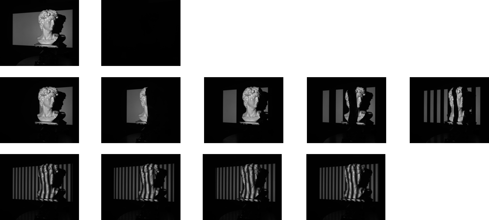

## 单目结构光三维重建

本项目使用"互补格雷码+相移码"方法获取被测物体的三维信息，欢迎**star**:star:收藏！

matlab版本代码解码和重建比较完整比较完整，python版本在[CSDN](http://t.csdn.cn/aSxGf)有更详细介绍。

> 点击[这里](support/结构光三维重建.pdf)查看PPT介绍。

### 1. 简介

系统硬件结构图如下：

#### :one:系统组成：

+ DLP投影仪：闻亭PRO6500
+ 灰度相机：FLIR BFS-U3-50S5
+ 旋转平台

#### :two:实验验证

使用上述硬件系统采集实验数据验证算法。

##### pattern图

##### 实验图片

##### 点云结果

#### :three:算法流程

假设已经获得了系统标定参数，使用互补格雷码+四步相移码方法进行三维重建，整个重建过程可以分为六个步骤：

1. 生成格雷码图像
2. 生成四步相移图像
3. 求解相对相位
4. 求解绝对相位
5. 获得相机-投影仪像素坐标之间的对应关系
6. 根据标定参数获得重建点云信息

> 详细内容可以查看[原理介绍](support/原理介绍.pdf)或者[CSDN](http://t.csdn.cn/aSxGf)

## 2. TODO

+ python版本代码编写计算三维点云代码
+ python版本代码重构
+ matlab版本代码优化效率
+ 补充投影仪-相机系统标定内容

## 3. 参考文献

[1] [Zhang Q, Su X, Xiang L, et al. 3-D shape measurement based on complementary Gray-code light[J]. Optics and Lasers in Engineering, 2012, 50(4): 574-579.](https://www.sciencedirect.com/science/article/pii/S0143816611002028)

[2] [张启灿, 吴周杰. 基于格雷码图案投影的结构光三维成像技术[J]. 红外与激光工程, 2020, 49(3): 0303004-1-0303004-13.](https://www.opticsjournal.net/Articles/OJ56c40f454bd9a1bf/Abstract)