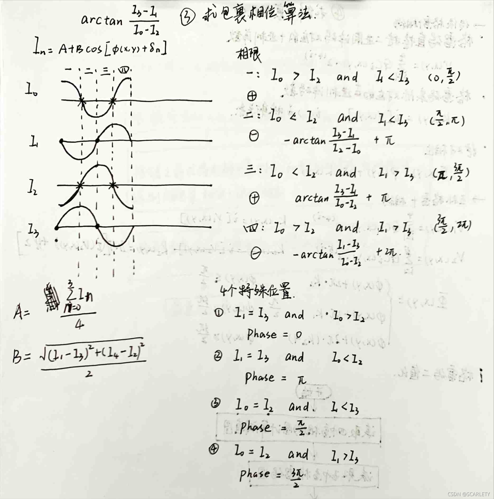
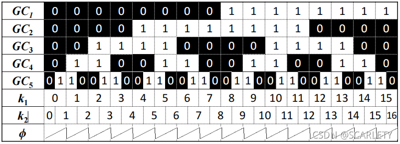
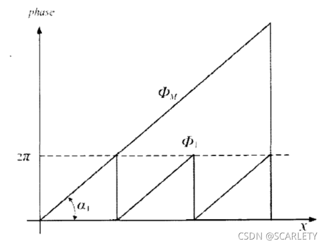
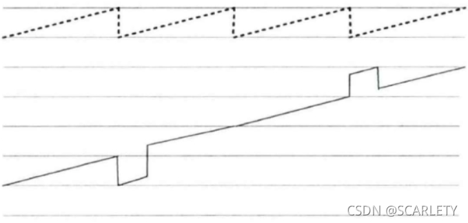
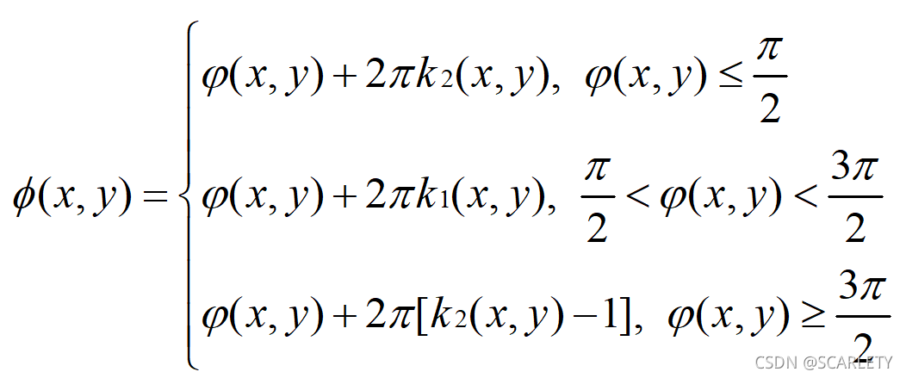

### 1. 生成格雷码图像

#### 1.1 格雷码

一种二进制码制，是一种无权码，它的特点是前后相邻码值只改变一位数，这样可以减小错位误差，因此又称为最小错位误差码。下面是四位格雷码值表：

|十进制数|普通二进制码|格雷码|
|---|---|---|
|0|0000|0000|
|1|0001|0001|
|2|0010|0011|
|3|0011|0010|
|4|0100|0110|
|5|0101|0111|
|6|0110|0101|
|7|0111|0100|
|8|1000|1100|
|9|1001|1101|
|10|1010|1111|
|11|1011|1110|
|12|1100|1010|
|13|1101|1011|
|14|1110|1001|
|15|1111|1000|

#### 1.2 生成n位格雷码

##### 1.2.1 传统方法生成：

+ 第一步，生成n位全零码
+ 第二步，改变最右端的码值
+ 第三步，改变自右起第一个“1”码元左边的码元
+ 重复第二、三步直至得到2^n个格雷码

可以看出，传统方法不容易用代码实现，接下来介绍递归法

##### 1.2.2 递归法

经过观察发现n位格雷码可以由（n-1）位格雷码得到，即

+ 第一步：（n-1）位格雷码正序排列最左侧（前缀）补0
+ 第二步：（n-1）位格雷码逆序排列最左侧（前缀）补1
+ 第三步：一、二步得到结果依次排列得到n位格雷码

如：
1位：  0    1
正序   <u>0</u>0     <u>0</u>1
逆序   <u>1</u>1     <u>1</u>0

2位：  00    01    11    10 
正序   <u>0</u>00     <u>0</u>01    <u>0</u>11    <u>0</u>10
逆序   <u>1</u>10     <u>1</u>11    <u>1</u>01     <u>1</u>00

3位：  000   001    011   010   110   111   101    100

可见递归法比较容易代码实现，因此本项目采用递归法生成n位格雷码

##### 1.2.3 格雷码与普通二进制码的转换

**传统方法**

+ 二进制码-->格雷码

二进制码与其右移一位高位补零后的数码异或后得到格雷码

> 如：二进制0010 --> 右移0001 -->0010 xor 0001 --> 格雷码0011

+ 格雷码-->二进制码

最左边的一位不变，从左边第二位起，将每位与左边一位解码后的值异或，作为该位解码后的值。依次异或，直到最低位。依次异或转换后的值（二进制数）就是格雷码转换后二进制码的值。

> 如：格雷码（用G表示）0011-->二进制码（用B表示）左边第一位不变0xxx-->解码的第二位G2 xor B1 =0 xor 0 -->00xx -->G3 xor B2 --> 001x  -->G4 xor B3 -->0010(二进制码)

**字典查询**

在生成格雷码的同时，将每一位格雷码与其对应的十进制数组成键值对储存在字典中，这样在进行二进制码、格雷码、十进制相互转换时可以直接查询字典完成比较方便.

本项目采用的互补格雷码，需要4位格雷码图和5位格雷码的最后一张，详细代码可以查看python版本代码。

### 2. 生成四步相移图像

#### 2.1 相移码

从**N步相移码**说起，首先相移码的原理是利用N幅正弦条纹图通过投影仪投射到物体表面再通过相机拍摄获取图像，通过所得图像计算每个位置的相位差，然后通过相位—深度的映射关系获取物体的深度信息。

投影光栅的光强函数：

$$I_{n}(x,y)=A(x,y)+B(x,y)cos[\varphi (x,y)+\Delta \varphi n]$$

$$\Delta \varphi_{n}=2\pi (n-1)/N (n\in [1,N])$$

> 式中：A(x,y)表示背景光强，B(x,y)表示调制幅值，$\varphi(x,y)$表示包裹相位（相对相位），$\Delta \varphi_{i}$表示平移相位。其中前三个变量未知，因此N至少取3。

#### 2.2 生成四步相移码

由于选用4位格雷码+四步相移，编码区域可以分为16，因此相移码的**周期数**$f=16$，**周期**$T=Width/f$，因此$\varphi (x,y)=\frac{2\pi fx}{Width}$

> T用像素表示,Width表示图像宽度(单位:像素)，实验投影仪width=1920（像素）因此T=1920/16

#####  代码生成步骤

第一步：生成一个1920维的行向量；
第二步：利用公式$I(x,y)=128+127cos[2\pi (\frac{fx}{Width}+\frac{n-1}{N})]$对每一个向量元素进行填充；
第三步：利用np.tile()函数生成1080行，得到1920*1080的矩阵；
第四步：利用cv2.imshow（）函数显示。

### 3. 求解相对相位

#### 3.1 包裹相位求解公式

N步相移法求包裹相位的详细推导可以参考这篇博客：标准N步相移主值相位计算式推导过程

这里给出四步相移法的求解公式：

$$I0(x,y)=A(x,y)+B(x,y)cos[\varphi (x,y)$$

$$I1(x,y)=A(x,y)-B(x,y)sin[\varphi (x,y)]$$

$$I2(x,y)=A(x,y)-B(x,y)cos[\varphi (x,y)]$$

$$I3(x,y)=A(x,y)+B(x,y)sin[\varphi (x,y)]$$

联立得：$\varphi(x,y)=arctan\frac{I3-I1}{I0-I2}$，由于反正切函数被限制在$[-\pi ,\pi ]$，因此该公式求解的是**包裹相位**。

#### 3.2 特殊位置

在实际的代码中我们需要考虑4个特殊位置和4个象限：

将每一个像素利用上述方法求得包裹相位并储存在对应位置，可以得到所有对应位置的数值大小都在，然后对其进行线性放缩到，再用cv2.imshow()显示。
​

### 4. 求解绝对相位

#### 4.1 互补格雷码级次图

​
图中GC表示格雷码图，k1、k2表示对应的编码值，现在我们需要将包裹相位还原成连续的绝对相位。我们发现，只要在每一个截断处加上$2k\pi$（k表示周期的级次），就可以恢复成连续的相位：

因此我们用四幅格雷码图像将整个有效视区分成16份并分别编码，因此这里的周期级次K就等于格雷码的编码值（k1），**但是由于实际过程中，由于投影仪和相机的畸变效应，所投的格雷码图像与相移码图像会产生错位**：

#### 4.2 绝对相位求解公式

由于错位发生在包裹相位的截断处，为了解决错位问题，我们引入一张5位格雷码，与4位格雷码形成互补，k2的计算公式为:

$$K2=INT[(V2+1)/2]$$

> INT:向下取整，V2：GC0-GC5格雷码对应的十进制数。

利用以下公式就可以避免截断处产生错位：

​
#### 4.3 实际求解过程

在相机实际拍摄的图片中由于环境光的影响，拍摄到的格雷码值并不是标准的二值图，因此:

**首先**要将格雷码图像进行二值化处理。

1. 选取二值化阈值：利用四幅相移码图像每个像素的均值作为阈值获得阈值图像TH_img
2. 将每一幅格雷码图像与阈值图的每一个对于对应像素进行对比，小于等于阈值赋值为0，大于阈值的赋值为1
3. 将二值化后的图像放缩到[0，255]以显示出来

**然后**计算k1、k2的值

**最后**带入公式求解绝对相位，由于相移码分为16个周期，因此最后的绝对相位是,再将获得的绝对相位A进行线性放缩得到$B=A \ast 255/32\pi$，显示出来。
​

### 5. 获得相机-投影仪像素坐标之间的对应关系

获得绝对相位后，就可以建立相机-投影仪像素坐标之间的对应关系，假设相机像素坐标为$(u_{c},v_{c})$，投影仪像素坐标为$(u_{p},v_{p})$，相移码一个周期所占的像素个数为$T$，那么通过相位关系可以得到如下关系式：

$$\Phi(u_{p},v_{p})=\Phi(u_{c},v_{c})$$

$$\Phi(u_{p},v_{p})=\frac{2\pi u_{p}}{T}$$

可以得到如下关系式：

$$u_{p}=\frac{\Phi(u_{p},v_{p}) \ast T}{2\pi}=\frac{\Phi(u_{c},v_{c}) \ast T}{2\pi}$$
​
在相机实际拍摄的图片中由于环境光的影响，拍摄到的格雷码值并不是标准的二值图，因此我们首先要将格雷码图像进行二值化处理
（i）选取二值化阈值：利用四幅相移码图像每个像素的均值作为阈值获得阈值图像TH_img

（ii）将每一幅格雷码图像与阈值图的每一个对于对应像素进行对比，小于等于阈值赋值为0，大于阈值的赋值为1

（iii）将二值化后的图像放缩到[0，255]以显示出来

然后计算k1、k2的值
最后带入公式求解绝对相位，由于相移码分为16个周期，因此最后的绝对相位是,再将获得的绝对相位A进行线性放缩得到B=A*255/，显示出来。
​

### 6. 根据标定参数获得重建点云信息

#### 6.1 根据内参数获得关系式

根据相机模型：

$$\begin{align}\begin{bmatrix} u_{c} \\ v_{c} \\ 1 \end{bmatrix} & = \begin{bmatrix} f_{cx} & 0 & u_{c0} & 0 \\ 0 & f_{cy} & v_{c0} & 0 \\ 0 & 0 & 1 & 0 \end{bmatrix} \frac{1}{Z_{c}} \begin{bmatrix} R_{w\rightarrow c} & t_{w\rightarrow c} \\ 0 & 1 \end{bmatrix} \begin{bmatrix} X_{w} \\ Y_{w} \\ Z_{w} \\ 1 \end{bmatrix} \notag \\ & = \begin{bmatrix} f_{cx} & 0 & u_{c0} \\ 0 & f_{cy} & v_{c0} \\ 0 & 0 & 1 \end{bmatrix}\begin{bmatrix}X_{c}/Z_{c} \\ Y_{c}/Z_{c} \\ 1 \end{bmatrix} \notag \\ &= \begin{bmatrix} f_{cx} & 0 & u_{c0} \\ 0 & f_{cy} & v_{c0} \\ 0 & 0 & 1 \end{bmatrix}\begin{bmatrix}x_{c} \\ y_{c} \\ 1 \end{bmatrix} \notag \end{align}$$

可以得到：

$$\left\{\begin{array}{ll}X_{c}=x_{c} \ast Z_{c} \\ Y_{c}=y_{c} \ast Z_{c} \\ Z_{c}=Z_{c} \end{array} \right. $$

由相机内参数可得

$$\left\{\begin{array}{ll}u_{c}=f_{cx} \ast x_{c} + u_{c0} \\ v_{c}=f_{cy} \ast y_{c} + v_{c0}\end{array} \right. \Rightarrow \left\{\begin{array}{ll}x_{c}=(u_{c} - u_{c0})/f_{cx} \\ y_{c}= (v_{c} - v_{c0})/f_{cy}\end{array} \right. $$

投影仪可以看作逆相机，因此投影仪模型与相机模型相同，同理可得：

$$\left\{\begin{array}{ll}X_{p}=x_{p} \ast Z_{p} \\ Y_{p}=y_{p} \ast Z_{p} \\ Z_{p}=Z_{p} \end{array} \right. $$

$$\left\{\begin{array}{ll}u_{p}=f_{px} \ast x_{p} + u_{p0} \\ v_{p}=f_{py} \ast y_{p} + v_{p0}\end{array} \right. \Rightarrow \left\{\begin{array}{ll}x_{p}=(u_{p} - u_{p0})/f_{px} \\ y_{p}= \ast (v_{p} - v_{p0})/f_{py}\end{array} \right. $$

#### 6.2 根据外参数获得方程

设相机投影仪系统的外参数为$R_{c \rightarrow p}=\begin{bmatrix}r_{11} & r_{12} & r_{13} \\ r_{21} & r_{22} & r_{23} \\ r_{31} & r_{32} & r_{33} \end{bmatrix}、t_{c \rightarrow p}=\begin{bmatrix}t_{x} & t_{y} & t_{z}\end{bmatrix}$

由下面式子，

$$\begin{bmatrix}X_{p} \\ Y_{p} \\ Z_{p} \end{bmatrix} = R_{c \rightarrow p}\begin{bmatrix}X_{c} \\ Y_{c} \\ Z_{c} \end{bmatrix} + t_{c \rightarrow p}$$

展开得：

$$\left\{\begin{array}{ll} X_{p} = r_{11}X_{c} + r_{12}Y_{c} + r_{13}Z_{c} + t_{x} = (r_{11}x_{c} + r_{12}y_{c} + r_{13})Z_{c} + t_{x} \\ Y_{p} = r_{21}X_{c} + r_{22}Y_{c} + r_{23}Z_{c} + t_{y} = (r_{21}x_{c} + r_{22}y_{c} + r_{23})Z_{c} + t_{y} \\ Z_{p}  = r_{31}X_{c} + r_{32}Y_{c} + r_{33}Z_{c} + t_{z} = (r_{31}x_{c} + r_{32}y_{c} + r_{33})Z_{c} + t_{z} \end{array} \right. $$

又由相机投影仪像素坐标得关系有：

$$\left\{\begin{array}{ll}u_{p}=f_{px} \ast x_{p} + u_{p0} \\ u_{p} =\frac{\Phi(u_{c},v_{c}) \ast T}{2\pi}\end{array} \right. \Rightarrow f_{px} \ast x_{p} + u_{p0} = \frac{\Phi(u_{c},v_{c}) \ast T}{2\pi} $$

最终得到连联立方程组：

$$\left\{\begin{array}{ll} x_{p} \ast Z_{p} = (r_{11}x_{c} + r_{12}y_{c} + r_{13})Z_{c} + t_{x} \\ Z_{p}  = (r_{31}x_{c} + r_{32}y_{c} + r_{33})Z_{c} + t_{z} \\ f_{px} \ast x_{p} + u_{p0} = \frac{\Phi(u_{c},v_{c}) \ast T}{2\pi} \end{array} \right. $$

解得：

$$Z_{c} = \frac{x_{p}t_{z}-t_{x}}{J_{x}-J_{z}x_{p}}$$

> $J_{x} = (r_{11}x_{c} + r_{12}y_{c} + r_{13})$；
> $J_{z} = (r_{31}x_{c} + r_{32}y_{c} + r_{33})$；
> $x_{p} = (\frac{\Phi(u_{c},v_{c}) \ast T}{2\pi} - u_{p0})/f_{px}$。

相机坐标系下的得三维坐标点为：

$$\left\{\begin{array}{ll}X_{c} = x_{c} \ast Z_{c} \\ Y_{c} = y_{c} \ast Z{c} \\ Z_{c} = \frac{x_{p}t_{z}-t_{x}}{J_{x}-J_{z}x_{p}} \end{array} \right.$$